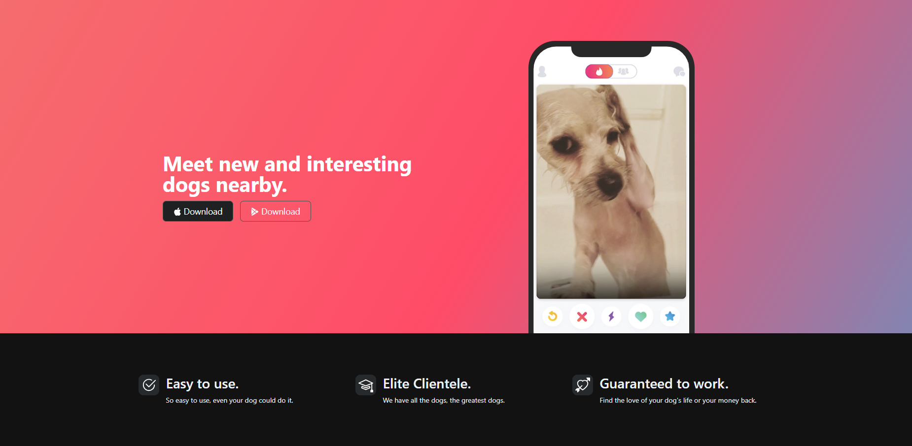
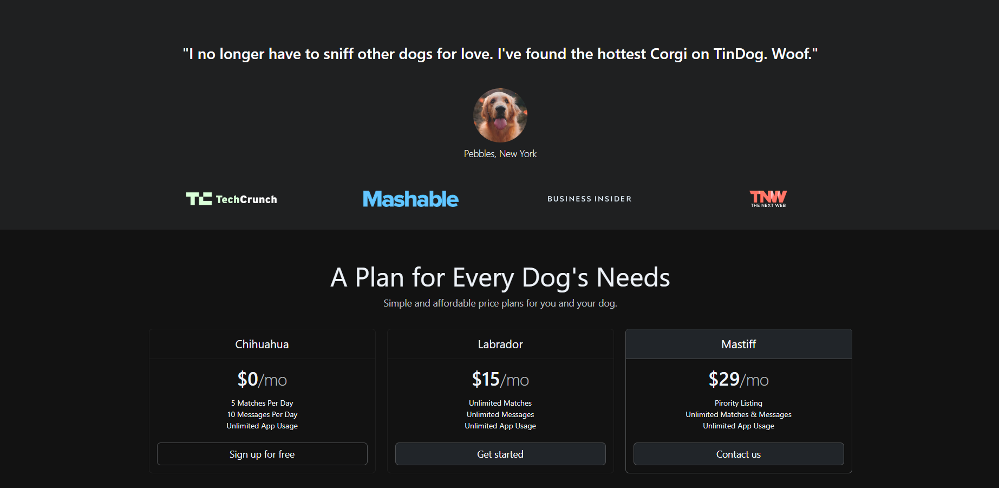
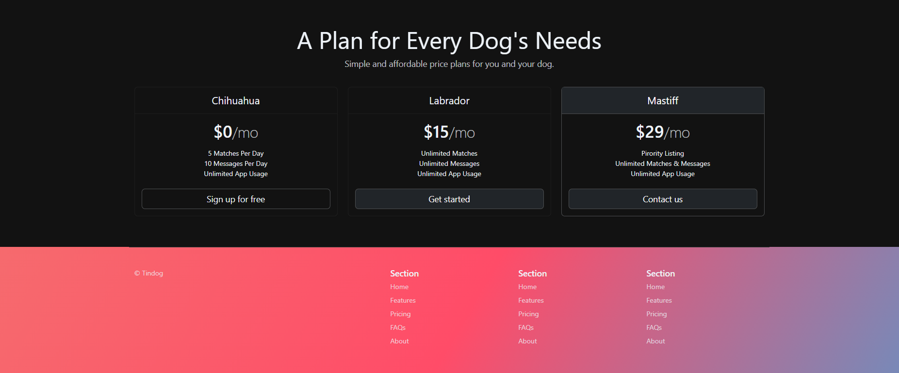

...

#  Tindog Website / Bootstrap / App Brewery - Angela Yu Project

...

# A fully responsive EXAMPLE project written in HTML-CSS (BootStrap) showing a website.

* This project is an example that was built along with a Udemy course (Angela Yu - App Brewery) showing how to create a responsive website in HTML-CSS. Every part of this project is sample code.

* Bu proje Angela Yu - AppBrewery tarafından hazırlanan hızlı yanıt verebilen bir HTML-CSS websitesinin örnek yapımını göstermektedir. Projenin her bir parçası örnek koddur.

## Take a look at the website ! - Websiteye bir göz atın !

